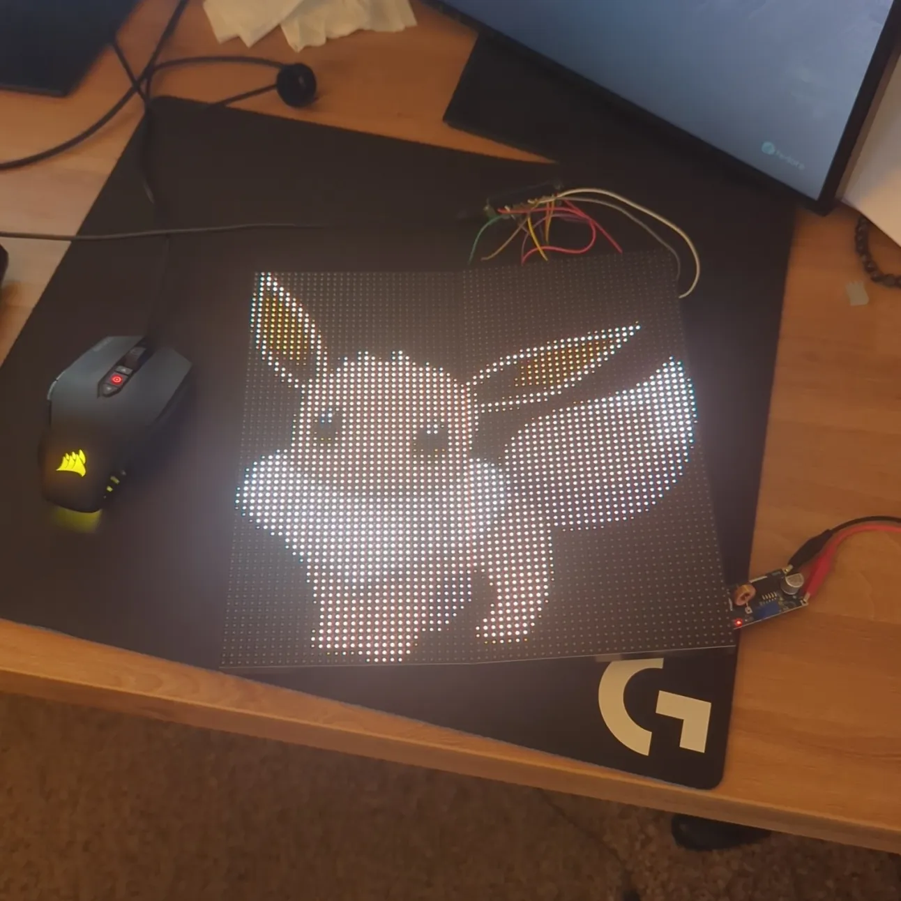
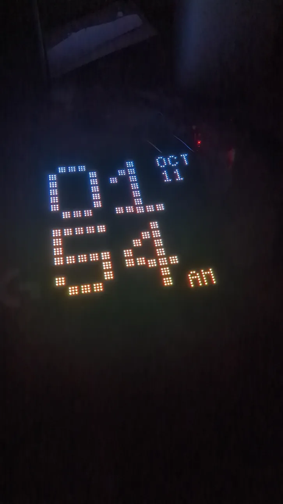

# LED Matrix
Firmware for the RP2040 that allows control of 1 or more daisy-chained LED Matrices over the Hub75 protocol.

Demos shown here are made using a pair of [Adafruit 64x32 RGB LED Matrix - 4mm pitch](https://www.adafruit.com/product/2278)

## Features
- Clock mode that pulls the current time from the internet using Network Time Protocol
- Send images over Wi-Fi to render to screen
- Render moving GIFs
- Render a 3d object file!! (Used as an open-ended final project for my computer graphics class)

## Photos

