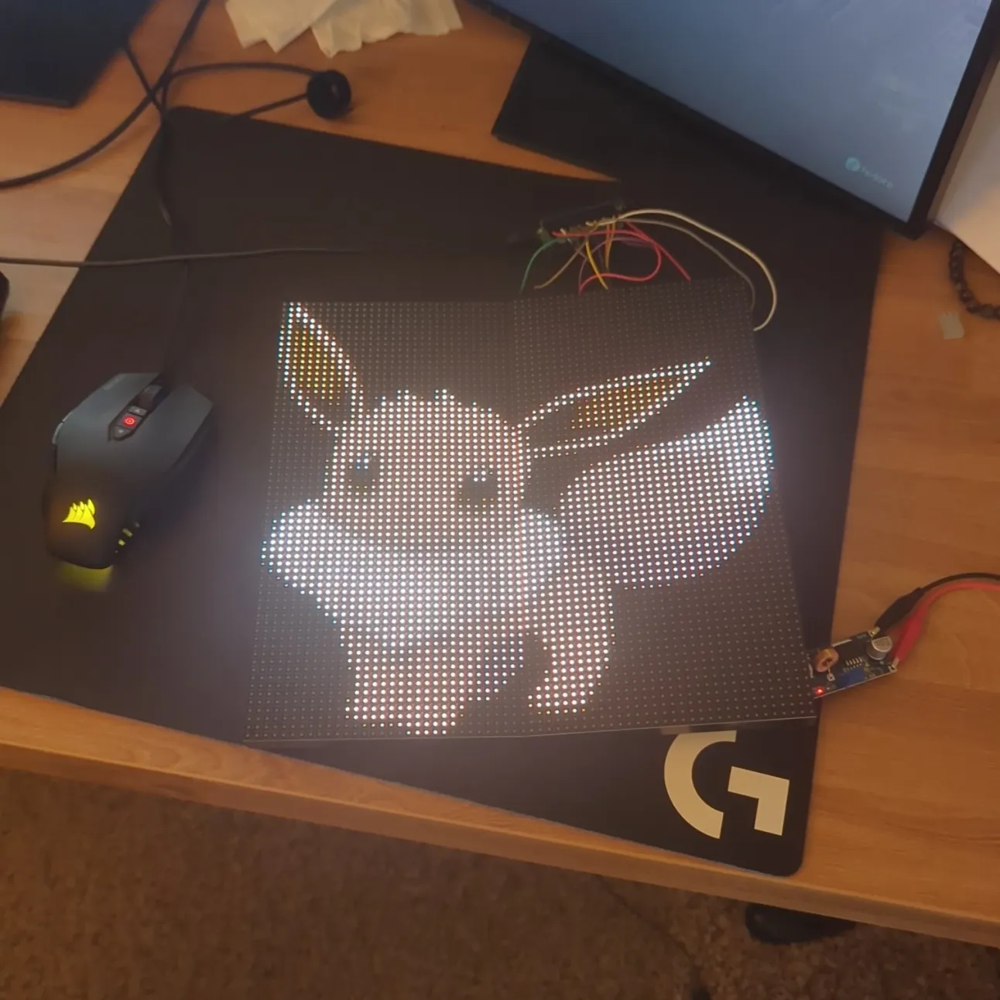
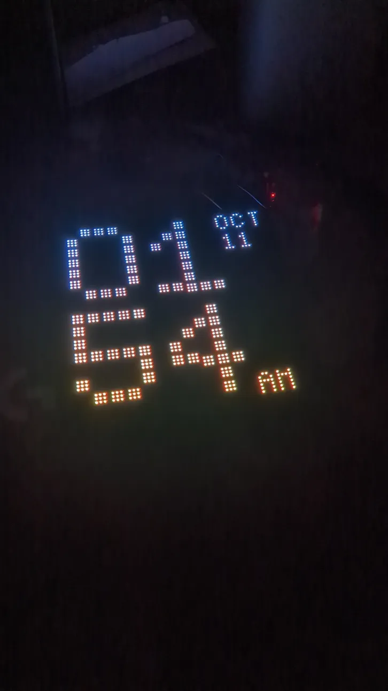

# LED Matrix OS
Firmware for the RP2040 that allows control of 1 or more daisy-chained LED Matrices over the Hub75 protocol.

Demos shown here are made using a pair of [Adafruit 64x32 RGB LED Matrix - 4mm pitch](https://www.adafruit.com/product/2278)

# Building

Requires CMake and GNU make.

In the project root, I run:
```
cmake -B build
cmake --build build/
```

Then plug in the Raspberry Pi Pico W in flash mode by holding the BOOT button before plugging in.
Then move `build/ledmatrix.uf2` into the USB storage device that the Pico creates.

# Usage

Connect to the device using the TCP console provided in `tools/tcpconsole.py`. It's currently hard coded to an IP address and port 2314.

```
start <app> // Starts an app by name as defined in src/Apps.hpp
forcequit <app> // Force quits an app by deleting the FreeRTOS task, does not perform any cleanup
msg <app_instance> <message> // Connects to an instance of an app as it appears in "listrunning" and sends a message
listrunning // Lists running processes
listapps // Lists all available apps
```

The script `tools/pictureframe.py` can be used to upload an image in a picture frame provided that you have already run `start pictureframe` in the tcp console.

# Apps
### `clock`
A visually pleasing clock that retrieves time from an NTP server if you are connected

### `pictureframe`
Displays static images on the screen in windows.
Add an image with `msg pictureframe0 add <x> <y> <width> <height>` followed by the raw BGR image data.

### `fire` and `rain`
Two demos of the visual capabilities of the OS, both written by ChatGPT. They can be safely `forcequit`.

# Features
- Clock mode that pulls the current time from the internet using Network Time Protocol
- Send images over Wi-Fi to render to screen
- Render moving GIFs
- Render a 3d object file!! (Used as an open-ended final project for my computer graphics class)

# Photos



